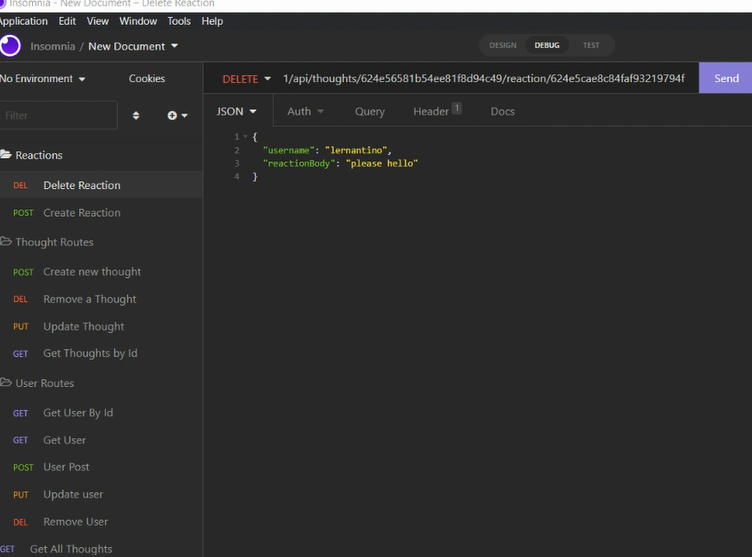

# Social Network Api

## Description
Inner terminal application, used to create, view, and remove users.  Attatched to the user, are thoughts, reactions, and friends that can be added or removed.

## Screenshot

## Demo
https://youtu.be/wnuSzG65btA

## Github
https://github.com/samposig/SocialNetworkApi